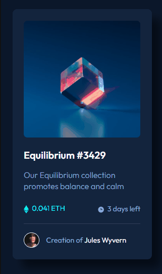

  

<h1 align='center'> NFT preview card component </h1>

	
	
	

_Para a versão em Português, clique [aqui](#portuguese)._ 

### Topics

- [Project description](#project-description)

- [Technologies used](#technologies-used)

- [What I learned](#what-I-learned)

- [Comparing the result](#comparing-the-result)

- [Access the Project](#access-the-project)

 

## Project description

This is a fictitious NFT Card . This project is one of the challenges proposed on the [Frontend Mentor](https://www.frontendmentor.io/home) site. The challenge is to recreate the project without the guidance of a design tool (figma) and making it as close as possible to the requested one. 

[The challenge](https://www.frontendmentor.io/challenges/nft-preview-card-component-SbdUL_w0U)

 

## Technologies used

    
  
Before refactoring

  
  
   
   
After refactoring

   

 

## What I learned

Before refactoring

- How to create and apply the 'active state' features proposed in the challenge using CSS.

 

After refactoring

- Recreate the project with the component structure in mind,
- Refactoring the whole project using styled-components and Vite.js

 

## Comparing the result

  

 

## Access the Project

You can [access the project here](https://caroline-barbosa-vilar.github.io/nft-preview-card-component/) 

 

<h1 align='center'> NFT preview card component </h1>

	
	
	

### Tópicos 

- [Descrição do projeto](#descrição-do-projeto)

- [Tecnologias utilizadas](#tecnologias-utilizadas)

- [O que aprendi](#o-que-aprendi)

- [Comparando o resultado](#comparando-o-resultado)

- [Acesse o projeto](#acesse-o-projeto)

 	

## Descrição do projeto 

Esse é um card NFT fictício. Esse projeto é um dos desafios propostos no site [Frontend Mentor](https://www.frontendmentor.io/home) e o desafio é recriar o projeto sem o auxílio de ferramentas de design (figma) deixando-o mais próximo possível do solicitado. 

[O desafio](https://www.frontendmentor.io/challenges/nft-preview-card-component-SbdUL_w0U)

 

## Tecnologias utilizadas

 
 
Antes de refatorar

  
  
   
 
Após refatorar

 

	
 

## O que aprendi

 
Antes de refatorar

- Como criar o comportamento proposto quando o mouse passar encima da imagem usando CSS.
 

Após refatorar

- Recriar o projeto pensando na estrutura de componentes,
- A refatorar o projeto todo usando styled-components e o Vite.js.

 

## Comparando o resultado

  

 
	
## Acesse o projeto

Você pode [acessar o projeto aqui](https://caroline-barbosa-vilar.github.io/nft-preview-card-component/) 

Developed with 🧡 by [me](https://www.linkedin.com/in/carolinebarbosavilar/)!
