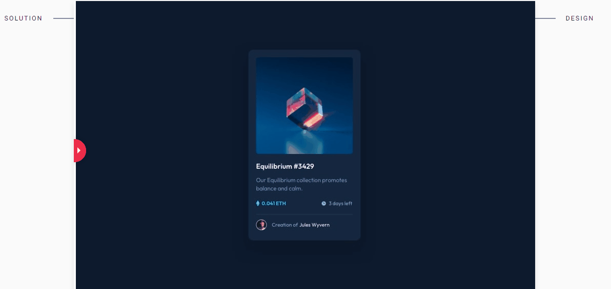
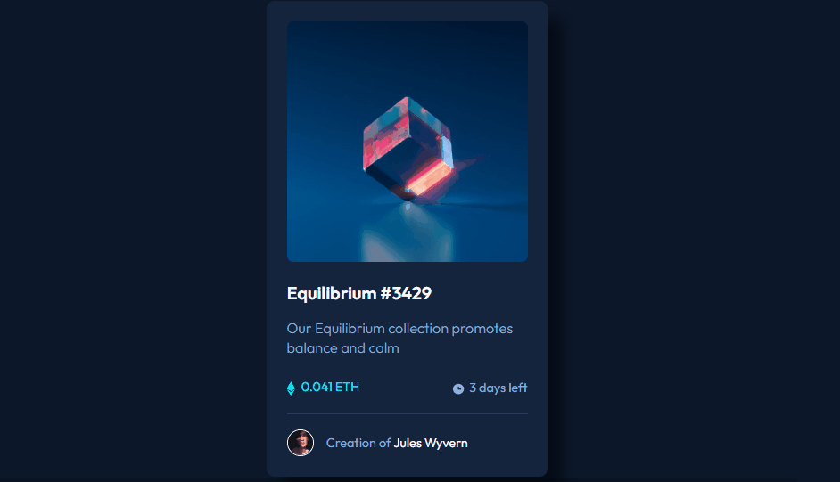

# NFT preview card component

_Para a versão em Português, clique [aqui](#portuguese)._

## The challenge:

The challenge was to build out this data storage component and get it looking as close to the design as possible (without figma design).

The users should be able to:

- View the optimal layout for the site depending on their device's screen size.

https://www.frontendmentor.io/challenges/nft-preview-card-component-SbdUL_w0U

## Technologies

- HTML;
- CSS.

## What I learned:

- How to create and apply the 'active state' features proposed in the challenge.

## My resolution: 

Mobile version:

Tablet version:

Desktop version:

---

  
## O desafio:

O desafio é desenvolver uma aplicação de armazenamento de dados e chegar mais próximo possível do design proposto (sem o design do figma).

Os usuários devem ser capazes de:

- Veja o layout ideal para o site, dependendo do tamanho da tela de seu dispositivo.

https://www.frontendmentor.io/challenges/fylo-data-storage-component-1dZPRbV5n/hub/fylo-data-storage-component-jX4-cWxdh

## Tecnologias

- HTML;
- CSS.

## O que aprendi:

- Como criar e aplicar as features propostas no desafio.

## Meu resultado: 

https://bo83dev.github.io/nft-preview-card-component/
  

  
